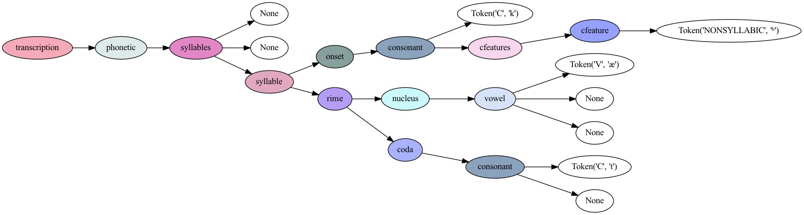

# ipa-grammar

Basic grammar for parsing International Phonetic Alphabet (IPA) transcriptions

## Setup

To graphically visualize parse trees, you'll need to install [Graphviz](https://graphviz.org/) from your package manager of choice.

For example, from [Homebrew](https://brew.sh/) on macOS:

```zsh
$ brew install graphviz
...
```

Install the dependencies in a Python virtual environment:

```zsh
$ python3 -m venv ipa
$ source ipa/bin/activate
(ipa) $ pip3 install -U pip
(ipa) $ pip3 install -r requirements.txt
...
```

To use the virtual environment in the Jupyter notebook, run:

```zsh
(ipa) $ ipython kernel install --user --name=ipa
(ipa) $ jupyter notebook ipa_grammar.ipynb
```

Then, choose the kernel with the name of the virtual environment:


## `ipa_grammar.py`

The `ipa_grammar.py` script has a basic CLI that allows you to read a "sentence" from a file (or `stdin`) and parse it with a given `.lark` grammar.  The script will attempt to pretty-print a parse tree as text and additionally generate a `.gv` graph that can be rendered as an image by Graphviz's `dot` program.

```zsh
(ipa) $ ./ipa_grammar.py -h
usage: ipa_grammar.py [-h] [-o OUTPUT] [-g GRAMMAR] input

positional arguments:
  input                 path to file to read input from (use "-" to read from stdin)

options:
  -h, --help            show this help message and exit
  -o OUTPUT, --output OUTPUT
                        path to file where graphviz graph will be written (default: None)
  -g GRAMMAR, --grammar GRAMMAR
                        path to .lark grammar file (default: ipa.lark)
```

For example:

```zsh
(ipa) $ echo '[kʰæt]' > cat-transcription.txt
(ipa) $ ./ipa_grammar.py cat-transcription.txt -g ipa.lark -o cat.gv
transcription
  phonetic
    syllables
      None
      None
      syllable
        onset
          consonant
            c
            cfeatures
              cfeature
                nonsyllabic
        rime
          nucleus
            vowel
              v
              None
              None
          coda
            consonant
              c
              None

(ipa) $ dot -Tpng -o cat.png cat.gv
```

This will generate a graphical parse tree in the file `cat.png`:



## Tests

To run the tests:

```zsh
(ipa) $ $ ./tests/run.zsh 
/mǎi mài mâi mái/ PASS
/ˈkatən/ PASS
[ˈkhætn̩] PASS
[ˈdʒæk|pɹəˌpɛəɹɪŋ ðə ˈweɪ|wɛnt ˈɒn‖] PASS
[↑bɪn.ðɛɹ↘|↑dɐn.ðæt↘‖] PASS
[túrán↑tʃí nè] PASS
[xɤn˧˥ xaʊ˨˩˦] PASS
[ˈɹɪðm̩] PASS
[ˈhuːˀsð̩ɣ] PASS
[ˈsr̩t͡sɛ] PASS
[ɹ̝̍] PASS
[ʙ̞̍] PASS
èlʊ́kʊ́nyá PASS
huʔ˩˥ PASS
mā PASS
nu.jam.ɬ̩ PASS
a˩˥˥˩˦˥˩˨˧˦˧ PASS
[u ↑ˈvẽ.tu ˈnɔ.ɾtɯ ku.mɯˈso.ɐ.suˈpɾaɾ.kõˈmũi.tɐ ˩˧fu.ɾiɐ | mɐʃ ↑ˈku̯ɐ̃.tu.maiʃ.su˩˧pɾa.vɐ | maiz ↑u.viɐ↓ˈʒɐ̃.tɯ.si.ɐk.õʃ↓ˈɡa.va.suɐ ˧˩ka.pɐ | ɐˈtɛ ↑kiu ˈvẽ.tu ˈnɔɾ.tɯ ˧˩d̥z̥ʃtiu ǁ] PASS
( while read l; do; echo -n "$l " | tee /dev/stderr | ( ./ipa_grammar.py - > )  5.86s user 0.20s system 99% cpu 6.113 total
```

## Know Issues

The grammar is not comprehensive, and the current parsing of syllable structures isn't going to work in all cases.  For example, there is no disambiguation of consonant clusters that could span syllable boundaries, nor is there disambiguation of adjacent vowels that might belong to different syllables.

## To Do
* Write a grammar for [IPA extensions](https://en.wikipedia.org/wiki/IPA_Extensions)
* Write grammars for specific languages taking phonotactics into account